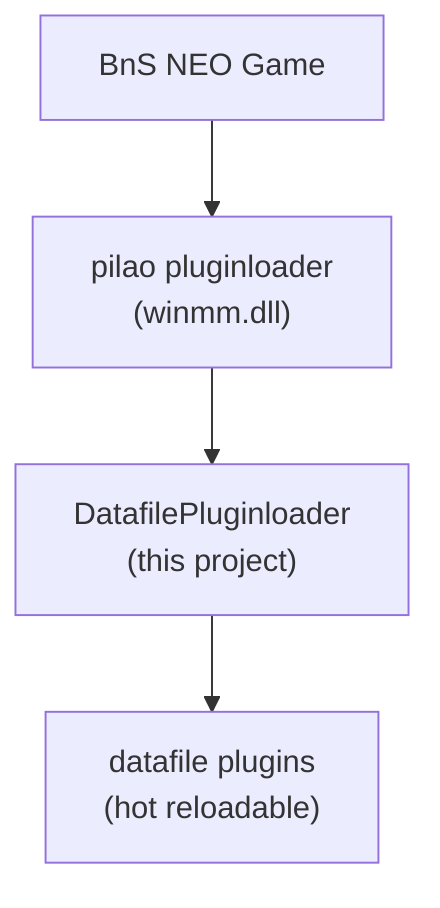

# BnsPlugin_DatafilePluginloader

## This is a BnS NEO Plugin that acts as an additional plugin loader to allow loading and reloading datafile hook plugins at runtime.

To avoid confusion with other bns plugins I will call this new layer "datafile plugins" in this readme.

## Load order visualized

The datafile pluginloader is a normal bns plugin (DLL) that hooks into the game using the existing pilao pluginloader (winmm.dll).
## What it does
It allows extremely lightweight datafile plugins to hook directly into the games "find data" process (when the game grabs data from a data table), allowing for easy reading and modification of game data.  
In combination with my BnsPluginTables this can be used to modify game data on the fly.  
Datafile plugins can be removed, updated and reloaded at runtime without restarting the game for quick testing.  
Press `Alt+Shift+O` ingame to reload all datafile plugins.
## Usage
- Create a folder named `datafilePlugins` in the same directory as `BNSR.exe`. (next to the other `plugins` folder)
- Place your datafile hook plugins (DLLs) in this folder.

You can find a very lightweight example in the `ExampleDatafilePlugin` project.  
Or a slightly bigger real world example in `ArtifactDatafilePlugin` project.
## Thoughts
I just thought the idea of a hot-reloadable datafile pluginloader as an additional layer was interesting and wanted to share it.
