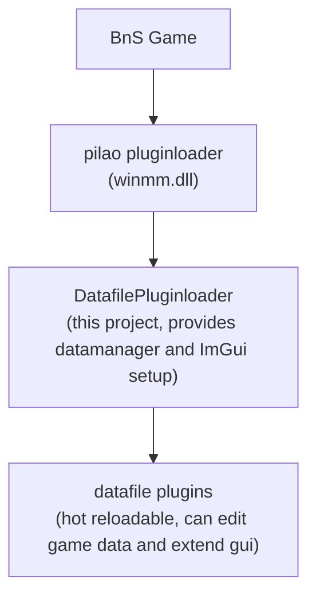

# BnsPlugin_DatafilePluginloader

A plugin for BnS that enables dynamic loading and hot-reloading of "datafile plugins" at runtime.

---

## Overview

**DatafilePluginloader** acts as an additional plugin loader for BnS, allowing you to load, update, and reload lightweight datafile hook plugins without restarting the game. For clarity, this layer is referred to as "datafile plugins" throughout this readme.

---

## Ingame Gui Example

## Load Order Diagram

---

## Features

- **Hot-reloadable plugins:** Add, update, or remove datafile plugins (DLLs) at runtime.
- **Direct data hooks:** Intercept the game's "find data" process for real-time data reading and modification.
- **ImGui integration:** Easily add custom configuration UIs for your plugins.
- **No restart required:** Reload all plugins instantly from the in-game UI.

---

## How It Works

- The DatafilePluginloader is a standard BnS plugin (DLL) that hooks into the game via the existing pilao pluginloader (`winmm.dll`).
- Datafile plugins can hook into the game's data table access, enabling on-the-fly data manipulation.
- The loader provides an ImGui-based UI for plugin configuration and management.

---

## Usage

1. **Install datafile pluginloader:**
   - Place `DatafilePluginloader.dll` into the `plugins` folder of your BnS installation (where `BNSR.exe` is located).

2. **Create the plugin folder:**
   - In the same directory as `BNSR.exe`, create a folder named `datafilePlugins` (next to the existing `plugins` folder).

3. **Add your plugins:**
   - Place your datafile plugin DLLs into the `datafilePlugins` folder.

4. **In-game controls:**
   - Press `INSERT` to open the settings UI.
   - Click `Reload all plugins` to refresh plugins without restarting the game.

---

## Examples

- **Demo GUI Example:** See the `ExampleDatafilePlugin` project.
- **Data Editing Example:** See the `ArtifactDatafilePlugin` project.
- **Animation Filter:** See the [BnsDatafilePlugin_AnimationRemover](https://github.com/leanleon93/BnsDatafilePlugin_AnimationRemover) project.
- **Item Swapping:** See the [BnsDatafilePlugin_ItemSwap](https://github.com/leanleon93/BnsDatafilePlugin_ItemSwap) project.
- **Template:** Build your own using the [DatafilePluginTemplate](https://github.com/leanleon93/BnsDatafilePlugin_CmakeTemplate) project.
---

## Notes

This project was created to explore the idea of a hot-reloadable datafile pluginloader with integrated GUI support. It is shared in the hope that others find it useful or inspiring.

---
